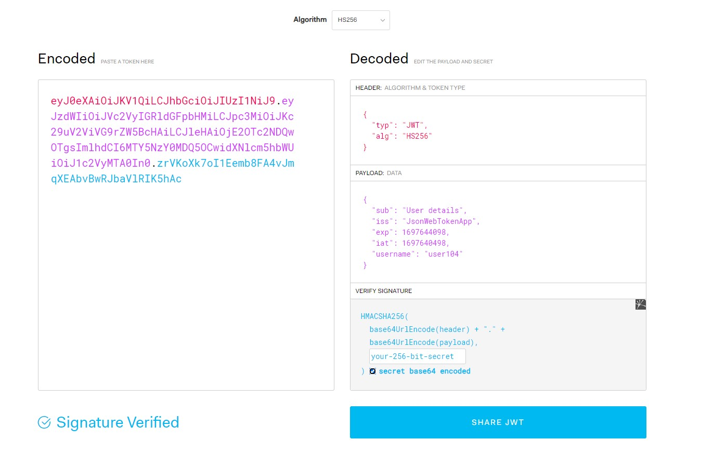
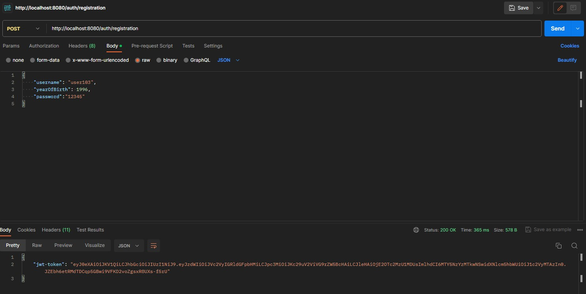
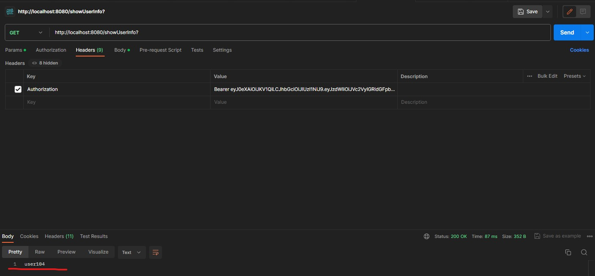

# REST Spring App 
## JWT Authentication 
**_JWT is an alternative way of user authentication_** that is most commonly used in ***microservices*** architecture. JWT is a stateless authentication mechanism, which means that no user data is stored on any of the servers. The user keeps their session on their own computer and passes a JSON with their data with every request to any of the services.

This is everything that would be stored in the user session, now it is stored in the user’s [JWT token](https://jwt.io/)
## Project Logic Preview
We add a person to the database, and from the server we received this JWT token, which contains data about the username that was created.

From the token we will get the **username**, extract userDetails, put userDetails in authToken, then in our context. From the context we will get authentication, from which we will get principal, this will be userDetails, that's it, **username**

## Install Project
You can simply paste:
``
git clone https://github.com/IBetULookGood/Spring-Lib-App
``