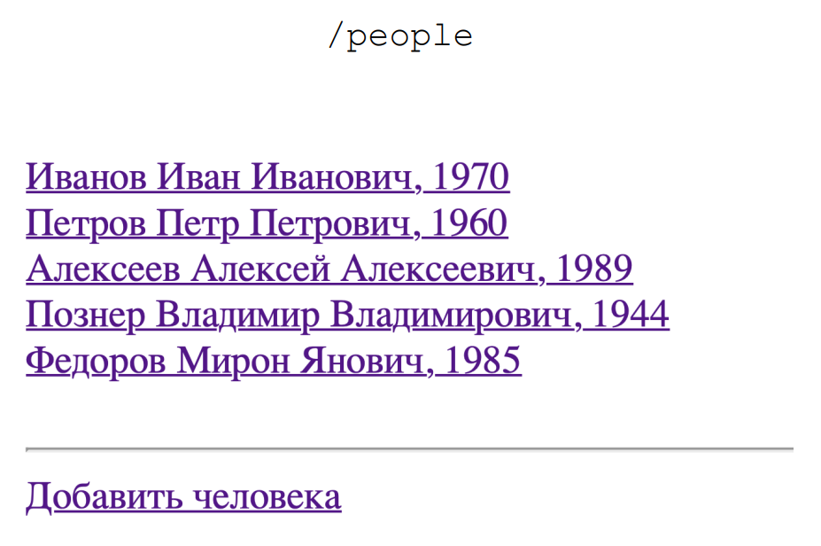

# Task
The local library wants to switch to digital bookkeeping.
Librarians have the ability to register readers, issue books to them, and release books (after the reader returns the book to the library).
There should be two tables in the database - Person and Book.
## Preview
### Page with a list of all people 

### Add a person page

### Person change page

### Internalization
It has been added Russian language support to the application. For this both
configuration file should be like here:
```Java   
private void registerCharacterEncodingFilter(ServletContext aContext){
        EnumSet<DispatcherType> dispatcherTypes = EnumSet.of(DispatcherType.REQUEST, DispatcherType.FORWARD);

        CharacterEncodingFilter characterEncodingFilter = new CharacterEncodingFilter();
        characterEncodingFilter.setEncoding("UTF-8");
        characterEncodingFilter.setForceEncoding(true);

        FilterRegistration.Dynamic characterEncoding = aContext.addFilter("characterEncoding", characterEncodingFilter);
        characterEncoding.addMappingForUrlPatterns(dispatcherTypes, true, "/*");
```
## Install Project
``git clone https://github.com/``